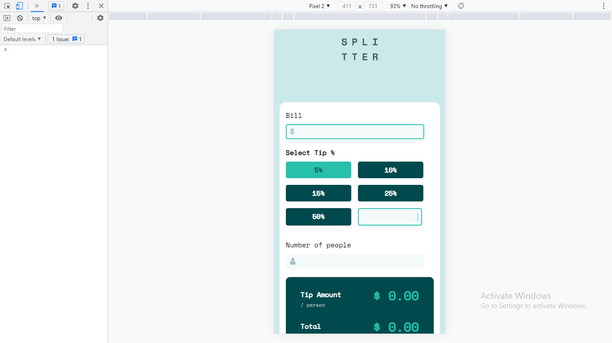
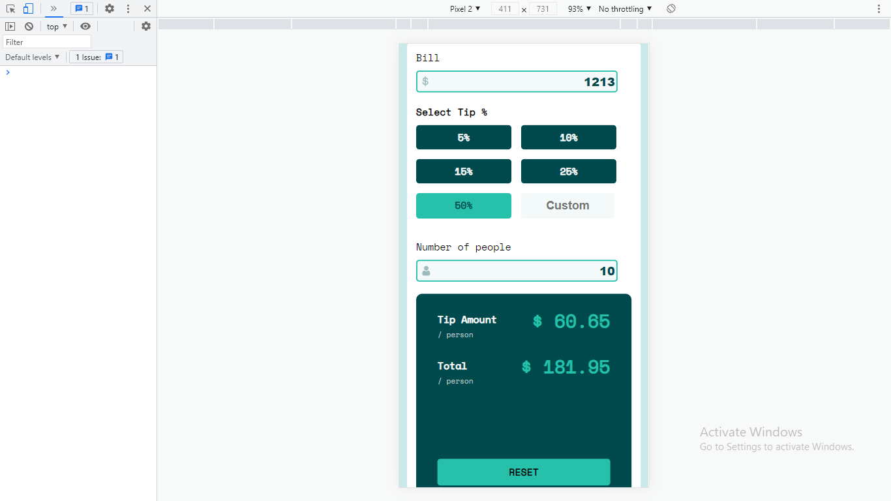
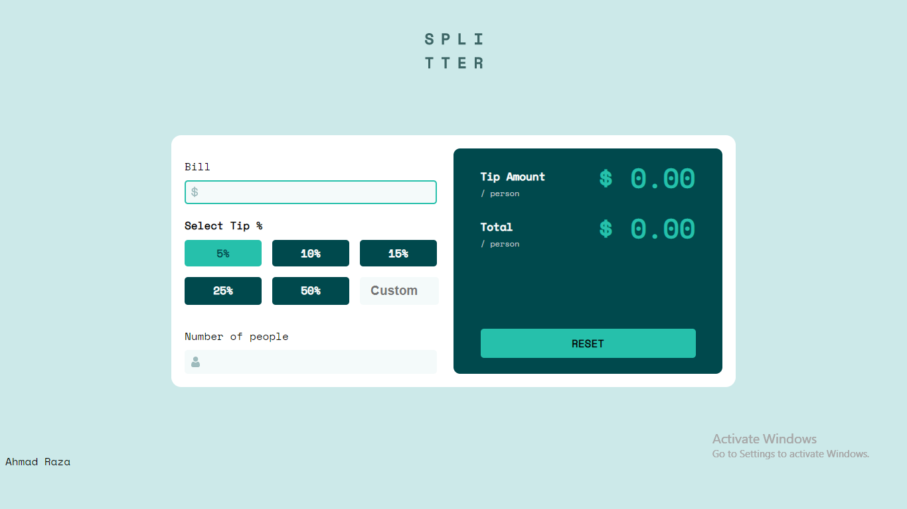
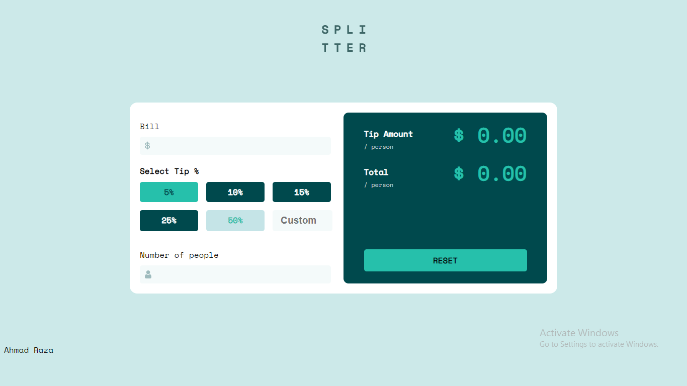
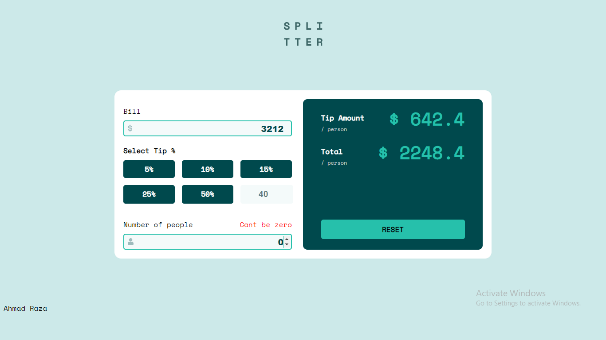
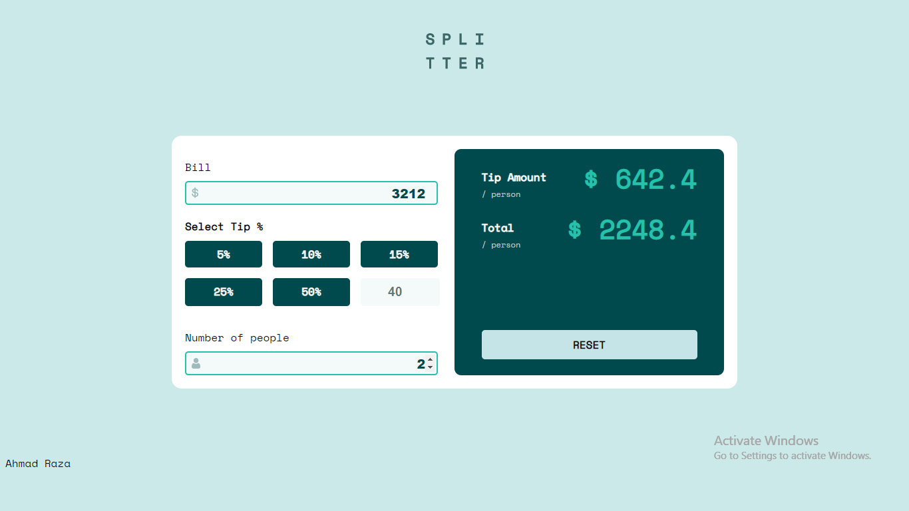

# Frontend Mentor - Tip calculator app solution

This is a solution to the [Tip calculator app challenge on Frontend Mentor](https://www.frontendmentor.io/challenges/tip-calculator-app-ugJNGbJUX). Frontend Mentor challenges help you improve your coding skills by building realistic projects.

## Table of contents

- [Overview](#overview)
- [Screenshot](#screenshot)
- [Links](#links)
- [Built with](#built-with)
- [Author](#author)
- [Acknowledgments](#acknowledgments)

## Overview

This is tip calcutor app

### Screenshot

### Links

- Solution URL: [Uploaded on my github account](https://github.com/razaahmad333/tip-calculator)
- Live Site URL: [On Netlify](https://condescending-mcclintock-5fa5f8.netlify.app/)
- Live Site URL: [On Vercel ](https://tip-calculator-nine.vercel.app/)

### Built with

- Semantic HTML5 markup
- CSS custom properties
- Flexbox
- CSS Grid
- Mobile-first workflow

## Author

- Website - [Ahmad Raza](https://compassionate-mccarthy-aacaae.netlify.app/index.html)
- Frontend Mentor - [@razaahmad333](https://www.frontendmentor.io/profile/razaahmad333)
- Twitter - [@AHMADRa01256865](https://twitter.com/AHMADRa01256865)

## Acknowledgments

I would like to thanks Front end mentor for providing such type of platform.
it brings confidence when you make something.
I would like to thanks traversy media, dev ed, stackoverflow
